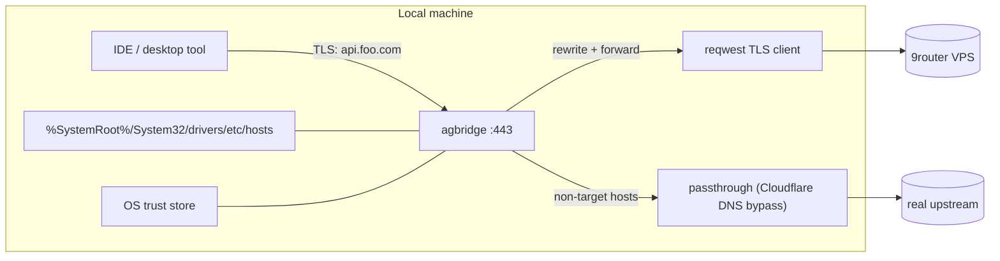

# agbridge

Local Windows-first TLS bridge that lets IDE plugins talk to your self-hosted [9router](https://github.com/decolua/9router) VPS, without changing any setting inside Antigravity, Copilot, Kiro, or Cursor. Single static Rust binary, no Node.js on the client.

## Status

> [!WARNING]
> Beta. P0 security tier is closed and the dispatcher is wired into the Windows Service Manager, but per-IDE handlers still need extended fuzz/replay testing against your live router. Pin the version you build and audit the diff before sharing the binary.

    ## How it works



1. `agbridge setup` writes a Root CA into `%LOCALAPPDATA%\agbridge\cert\` and patches the hosts file so the IDE's hostnames resolve to `127.0.0.1`.
2. `agbridge start` listens on `127.0.0.1:443`, terminates TLS with a leaf cert signed by the local Root CA, decodes the per-IDE wire format, and forwards a normalized payload to your 9router URL.
3. Hosts that we hijack but do not intercept (telemetry, OAuth refresh) are passed through to the real upstream via a public-DNS resolve so the IDE features keep working.

## Quick start (Windows)

```
git clone https://github.com/thinhphan109/agbridge.git
cd agbridge
cargo build --release
.\target\release\agbridge.exe config-set router_url=https://your-vps.example.com api_key=sk-xxx
# Run elevated:
.\target\release\agbridge.exe setup
.\target\release\agbridge.exe start
```

Press `Ctrl+C` to stop. agbridge cleans the hosts file and removes its PID file before exiting.

### As a background service

```
.\target\release\agbridge.exe service install   # registers in SCM, auto-start
.\target\release\agbridge.exe service start
.\target\release\agbridge.exe service status
.\target\release\agbridge.exe service stop
.\target\release\agbridge.exe service uninstall
```

The service binary launches with the internal `scm-run` sentinel and reports state to SCM via `set_service_status`.

## Day-to-day commands

| Command                              | Purpose                                                                  |
| ------------------------------------ | ------------------------------------------------------------------------ |
| `agbridge status`                    | JSON: hosts entries, cert install state, listen address                  |
| `agbridge doctor`                    | Probes router health + TLS handshake to **real** upstream (pinning test) |
| `agbridge config-show`               | Print resolved config with secrets redacted                              |
| `agbridge config-set router_url=...` | Update a single key without editing TOML                                 |
| `agbridge stop`                      | Read PID file, kill the running instance, clean hosts                    |
| `agbridge cleanup`                   | Remove hosts entries (does NOT touch cert)                               |
| `agbridge cleanup --hard`            | Hard kill switch: remove hosts + uninstall Root CA + shred private key   |
| `agbridge uninstall-cert`            | Just remove the Root CA from the trust store                             |

## Configuration

Default path: `%APPDATA%\agbridge\config.toml`. Run `agbridge config-show` to see it. Example:

```toml
router_url = "https://router.example.com"
api_key    = "sk-xxx"
listen_addr = "127.0.0.1:443"

[tools.antigravity]
enabled = true

[tools.copilot]
enabled = true

[tools.kiro]
enabled = true

[tools.cursor]
enabled = false   # off by default
```

`listen_addr` must be a loopback address; non-loopback bind requires `agbridge start --allow-remote` and a logged warning.

## Security model

| Defense                         | Where                                                            |
| ------------------------------- | ---------------------------------------------------------------- |
| Bind 127.0.0.1 only             | `default_listen()` + `ensure_loopback`                           |
| Hosts file backup + atomic swap | `agbridge-dns::HostsEditor::atomic_write`                        |
| Root CA Name Constraints        | `agbridge-cert::generate_root_ca` (whitelists 6 target hosts)    |
| ACL-locked private key + config | `icacls /inheritance:r /grant:r %USERNAME%:F` post-write         |
| Egress lock                     | `Upstream::resolve` rejects URLs whose host ≠ `router_url`       |
| Anti-loop                       | `x-request-source: local` header attached on every forward       |
| Redacted logs                   | `agbridge-logging::RedactingFields` (Bearer / sk-\* / x-api-key) |
| Hard kill switch                | `agbridge cleanup --hard`                                        |
| Graceful shutdown               | Ctrl+C/Break/Close on Windows triggers hosts cleanup before exit |

See [security_review.md](./SECURITY.md) (linked) for threat model + remaining P1 items.

## Troubleshooting

- **`Failed to bind 127.0.0.1:443`** — port already in use. Stop any other proxy or run `agbridge stop` first.
- **IDE shows TLS error** — Root CA was not installed, or the IDE pins certs (`agbridge doctor` will surface a `FAIL` line for that host).
- **Service start times out** — the binary was launched without `scm-run` (a stale `agbridge service install` from before this version). Run `service uninstall` then `service install` again.
- **`config.toml` shows `[REDACTED]`** — that is intentional. Use `agbridge config-show` if you need the literal key, but never paste the result into chat.

## Uninstall

```
agbridge service stop
agbridge service uninstall
agbridge cleanup --hard
```

This removes the hosts entries, uninstalls the Root CA, and shreds `rootCA.key`. Then you can delete `%APPDATA%\agbridge\` and `%LOCALAPPDATA%\agbridge\`.

## License

MIT.
